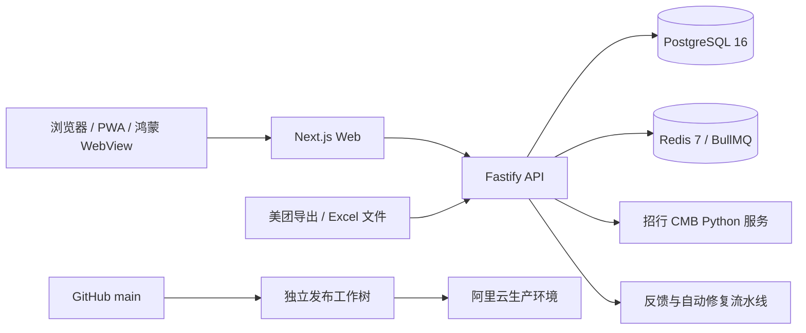

# 滇界 V4 项目完整交接与评审基线

> 文档状态：当前权威交接文件  
> 编制时间：2026-08-14（America/Los_Angeles）；生产核验时间为 2026-08-15（Asia/Shanghai）  
> 适用对象：接手开发的 AI、架构师、后端/前端/测试/运维人员  
> 代码目录：`/Users/somnusyi/Documents/Codex/dianjie-V4-rebuilt`  
> 生产站点：<https://www.njdianjie.com>  
> 当前生产提交：`e0e3b83c9feb2d9c12bacd82c448648bd4729741`

## 0. 先读结论

滇界 V4 已不是原型，而是一套正在真实经营场景中使用的多角色连锁餐饮系统。它已经覆盖门店订货、供应链接单配送、门店收货与到货差异、仓库库存、销售日报、BOM 消耗、财务与管理视角、反馈和自动修复等流程。

当前 GitHub `main`、本地 `HEAD` 与生产部署标记完全一致，生产 API、Web、招商银行辅助服务均在线，健康检查正常。系统已经登记 6 家门店，但“登记完成”不等于每家店都完成了真实业务 UAT。

下一阶段不宜继续无边界增加页面。应以“数据口径、状态机、单位换算、对账闭环、权限矩阵、可观测性”为主线收敛系统，优先解决：

1. 修复单号按月份生成时受服务器时区影响的问题。
2. 把供应链的“基准库存 + 每日出入库 + 次日实盘核对”做成清晰、可解释、可追溯的闭环。
3. 收敛 30 个待确认库存单位、280 个推断单位和日报中的 156 个待处理 BOM 任务。
4. 在开启仓库强库存约束前，完成影子库存对账和异常处理。
5. 对 6 家门店逐店做真实角色、真实数据、真实流程的验收。

## 1. 产品目标与边界

### 1.1 目标

- 支撑餐饮集团从 1 家店扩展到多店使用。
- 门店、总厨、供应链、财务、老板使用同一套业务数据。
- 打通“商品主数据 → 订货 → 接单 → 配送 → 收货 → 差异/报损 → 门店库存 → 销售/BOM 消耗 → 经营和财务分析”。
- 在未接通美团 API 的阶段，用标准 Excel 日报和库存文件维持可审计的数据链。
- 所有资金、库存、订单变更均可追溯，避免直接改最终数字。

### 1.2 当前明确边界

- 门店库存与供应链总仓库存是两个独立账本，不能混为一谈。
- 门店当前以“最近盘点/基准 + 收货 - BOM/人工消耗 - 报损”计算实时预估库存。
- 供应链总仓当前只有一个默认仓，但模型保留多仓扩展能力。
- 所有货物直接配送到门店；暂不建设复杂中心仓调拨网络。
- 仓库库存模式目前是 `OFF`，库存账可观察，但不会强制拦截发货。
- 暂未接美团 API；店长每日上传前一日营业统计和菜品销售文件。
- 招商银行自动支付没有证据表明已启用，不应擅自开启。

## 2. 技术架构



### 2.1 Monorepo 组成

| 目录 | 技术 | 作用 |
|---|---|---|
| `apps/web` | Next.js 14、React 18、Tailwind、Zustand、Recharts | 全角色 Web/PWA 前端 |
| `apps/api` | Fastify 4、TypeScript、Zod、Prisma、BullMQ | 业务 API、队列任务、权限与事务 |
| `apps/cmb` | Python 服务 | 招商银行加解密/接口辅助服务 |
| `apps/harmony` | ArkTS、HarmonyOS NEXT WebView | 鸿蒙客户端壳，加载生产 Web |
| `packages/db` | Prisma 5.22 | 数据模型、迁移、种子与数据库客户端 |
| `scripts` | Shell/TypeScript | 发布、验证、迁移链和专项数据脚本 |

### 2.2 规模快照

- API 路由注册约 360 个。
- Next.js `page.tsx` 页面约 196 个。
- Node.js 20.x。
- pnpm 10.32.1。
- Prisma 5.22.0。

### 2.3 核心架构原则

- 所有业务查询和写入必须带租户边界。
- 门店角色限制到门店；供应商角色限制到供应商；供应链角色只在授权领域做租户级管理。
- 金额使用 Decimal，不使用浮点数做最终账务计算。
- 关键写入必须有事务、幂等键或唯一约束。
- 操作日志、业务事件与主业务写入尽量在同一事务内完成。
- 已生效单据不直接覆盖，应使用更正单、冲销、差异单或调整流水。
- 商品主数据变更后要失效对应 Redis 缓存。
- 生产只允许迁移部署，禁止 `prisma db push`。
- 业务关键确认不用浏览器原生 `alert/confirm/prompt`，应使用系统确认组件。

## 3. 代码、仓库与生产状态

### 3.1 Git 状态

- 当前分支：`main`
- 本地 `HEAD`：`e0e3b83c9feb2d9c12bacd82c448648bd4729741`
- GitHub `origin/main`：同上
- 生产 `.deployed-commit`：同上
- GitHub：`git@github.com:somnusyi/dianjie-V4.git`
- Gitea：`http://192.168.1.129:1606/weilun/dianjie-V4.git`
- 2026-08-14 核验时，Gitea 所在局域网地址 `192.168.1.129:1606` 不可达，无法确认镜像是否同步到最新提交。

### 3.2 生产状态

- 服务器：阿里云 `116.62.32.162`
- 运行目录：`/app/dianjie-v4`
- PM2 进程：
  - `dianjie-v4-api`：online
  - `dianjie-v4-web`：online
  - `dianjie-v4-cmb`：online
- 健康检查：`status=ok`、`db=ok`、应用版本 `1.1.0`

#### 生产服务器连接方式

当前生产服务器通过 SSH 公钥认证连接：

```bash
ssh root@116.62.32.162
```

连接参数：

| 参数 | 值 |
|---|---|
| 主机 | `116.62.32.162` |
| SSH 端口 | `22` |
| 用户 | `root` |
| 认证 | SSH 公钥；不在本文保存密码或私钥 |
| 项目运行目录 | `/app/dianjie-v4` |

当前这台 Mac 已配置可用的 SSH 身份，可使用非交互方式验证：

```bash
ssh -o BatchMode=yes -o ConnectTimeout=8 root@116.62.32.162 'echo connected'
```

登录后的常用只读检查：

```bash
cd /app/dianjie-v4

# 当前生产部署提交
cat .deployed-commit

# 进程状态
pm2 status

# API、Web、CMB 健康检查
curl -fsS http://127.0.0.1:4004/health
curl -sS -o /dev/null -w '%{http_code}\n' http://127.0.0.1:3204/v2/login
curl -fsS http://127.0.0.1:5001/health

# 最近日志；避免长时间持续跟随
pm2 logs dianjie-v4-api --lines 50 --nostream
pm2 logs dianjie-v4-web --lines 50 --nostream
pm2 logs dianjie-v4-cmb --lines 50 --nostream
```

新电脑不能登录时，不要索取或发送现有私钥。应在新电脑生成独立密钥，把 `.pub` 公钥交给服务器管理员加入 `/root/.ssh/authorized_keys`：

```bash
ssh-keygen -t ed25519 -C 'dianjie-deploy-新电脑标识'
cat ~/.ssh/id_ed25519.pub
```

只发送输出的整行公钥；`~/.ssh/id_ed25519` 私钥不得发送、上传或提交 Git。服务器写操作、数据库写操作、PM2 重启和正式发布仍需获得项目负责人授权。

### 3.3 发布规则

生产发布应从独立、干净的发布工作树执行 `scripts/deploy-worktree.sh`。脚本会检查：

1. 发布提交是否属于 `origin/main`。
2. 依赖、构建和迁移是否成功。
3. API/CMB 健康状态。
4. Web HTML/CSS 和静态资源 MD5。
5. 成功后才写入 `.deployed-commit`。

不要在开发目录直接覆盖生产，也不要绕过发布脚本手工替换文件。

### 3.4 本地未提交内容

当前工作区不是干净状态，以下内容不得被接手者误删或覆盖：

- `apps/harmony/AppScope/app.json5`：版本从 `1.0.0/1` 调整为 `1.0.1/2`。
- `apps/harmony/build-profile.json5`：本机发布签名路径、Profile、证书与目标 SDK 调整；含签名材料配置，严禁复制到交接文档或聊天。
- `.codex-artifacts/`
- 多份历史交接文档和库存审计表。

这些鸿蒙改动尚未进入 GitHub `main`，也不属于当前生产 Web/API 部署。

## 4. 角色与权限模型

Prisma 角色包括：

`SUPER_ADMIN`、`ADMIN`、`FINANCE`、`MANAGER`、`PURCHASER`、`SUPPLIER_STAFF`、`CHEF`、`KITCHEN_LEAD`、`CHEF_DIRECTOR`、`SUPPLIER_OWNER`、`SUPPLY_CHAIN`、`ENGINEERING`、`SUPERVISOR`、`STAFF`。

生产当前活跃账号按角色统计：

| 角色 | 活跃账号数 |
|---|---:|
| SUPER_ADMIN | 1 |
| ADMIN | 1 |
| FINANCE | 3 |
| MANAGER | 2 |
| KITCHEN_LEAD | 4 |
| CHEF_DIRECTOR | 3 |
| SUPPLY_CHAIN | 10 |

账号密码、服务器密钥、数据库地址和第三方 API Key 不写入本文件，应由项目负责人单独、安全地提供。

### 4.1 角色职责简表

| 角色 | 核心职责 |
|---|---|
| 店长 | 营业日报、经营数据、门店预估库存、盘点历史、日常待办 |
| 厨师长 | 订货、改单确认、收货验收、到货差异、报损、实时预估库存 |
| 总厨 | 菜品档案、BOM 版本、收银菜名映射、上新/下架、原料变更 |
| 供应链 | 接单、改数量/发货、配送、总仓库存、上游供应商、差异处理 |
| 财务 | 各店、单据、应付、对账、凭证、发票、资金与期间管理 |
| 老板/管理层 | 跨店经营、利润、异常、资金和供应链健康度 |

## 5. 生产数据快照

以下是交接时对生产数据库的只读核验结果。

### 5.1 主数据

| 对象 | 数量/状态 |
|---|---:|
| 门店 | 6，全部启用 |
| 供应商 | 2 |
| 商品 | 595；启用 497 |
| 菜品 | 163；在售 153 |
| 商品外部编码映射 | 646 |
| 商品上游来源映射 | 0 |

门店：

| 编码 | 名称 |
|---|---|
| DJ001 | 合肥瑶海店 |
| DJ002 | 合肥包河万达店 |
| DJ003 | 南京城北万象汇店 |
| DJ004 | 上海南京东路店 |
| DJ005 | 无锡八佰伴店 |
| DJ006 | 江阴八佰伴店 |

供应商：

| 编码 | 名称 | 业务范围 | 库存模式 |
|---|---|---|---|
| 002 | 武定县欣萌农产品销售店（夏竹青） | `WAREHOUSE_UPSTREAM` | `NOT_TRACKED` |
| SUP001 | 南京捌拾捌号餐饮管理有限公司 | `STORE_FULFILLER` | `NOT_TRACKED` |

这里必须区分：

- 上游供应商：向供应链总仓供货。
- 门店供货主体：供应链向门店履约时使用的主体。
- 商品管理页更适合展示商品采购来源/上游供应商，不应把门店供货主体误当作每个商品的真实上游来源。

目前 `ProductUpstreamSource` 为 0，说明模型和页面已有，但 SKU 到真实上游供应商的映射还未落地。

### 5.2 商品单位质量

| 单位状态 | 数量 |
|---|---:|
| VERIFIED | 285 |
| INFERRED | 280 |
| PENDING | 30 |

单位模型采用四类单位：采购单位、订货单位、成本单位、库存基准单位。转换因子表达“1 个对应单位等于多少库存基准单位”。订单、配送、收货和流水应冻结当时单位和转换因子，不能随主数据修改而改写历史。

## 6. 业务模块现状

### 6.1 订货、接单、配送与收货

当前生产数据：

| 对象 | 状态统计 |
|---|---|
| 采购单 72 | CANCELLED 4、COMPLETED 61、DELIVERING 1、RECEIVED 6 |
| 配送单 69 | RECEIVED 68、SHIPPED 1 |
| 收货单 | 68 |
| 报损/差异单 29 | APPROVED 16、AUTO_APPROVED 6、REJECTED 7 |

已实现的关键规则：

- 门店下单后，供应商/供应链接单和发货。
- 供应链发货前可调整实发数量，但门店/厨师长必须确认改单。
- 改单前不能接单；改单价格不能被供应链静默修改。
- 原始订单快照保留，确认后使用更正结果继续流转。
- 门店按实收数量入库，应付按确认后的有效收货口径计算。
- 收货完成后允许补报拆包后发现的异常。
- 报损/短缺可以上传图片或视频证据，并支持打印带图片的差异单。
- 供应链可同意、拒绝或提交仲裁；相关权限已修复。
- 已入账收货支持厨师长确认的更正流程；未支付计划可同步更正，已支付计划不直接改写。

当前需要立刻核对：仍有 1 张 `DELIVERING` 采购单和 1 张 `SHIPPED` 配送单，需判断是正常在途还是卡单。

### 6.2 供应链总仓与库存账

当前仓库：1 个默认仓，`inventoryMode=OFF`。

| 对象 | 数量 |
|---|---:|
| WarehouseLedgerBalance | 363 |
| WarehouseLedgerMovement | 1,467 |
| OPENING_BALANCE | 363 |
| ADJUSTMENT | 932 |
| MANUAL_INBOUND | 38 |
| ORDER_OUTBOUND | 134 |

`OFF` 的真实含义：库存台账已经存在且可显示，但暂不作为发货的硬拦截依据。不要把它误读为“系统没有库存”，也不要直接改为 `STRICT`。

#### 已导入库存文件

| 日期 | 导入单号 | 状态 | 匹配/阻断 | 应用方式 |
|---|---|---|---|---|
| 08-03 | WSI-20260803-C8FF8401 | CONFIRMED | 302 / 0 | 基准库存 |
| 08-08 | WSI-20260808-D3F0A8B1 | CONFIRMED | 314 / 0 | 新基准；25 新建、289 调整 |
| 08-10 | WSI-20260810-7481B4CC | CONFIRMED | 327 / 99 | 基准；11 新建、316 调整 |
| 08-11 | WSI-20260811-F2AC9A4C | STAGED | 332 / 99 | 每日流水对账；已写 38 入库、134 出库 |
| 08-14 | WSI-20260814-0F75F592 | CONFIRMED | 340 / 0 | 新基准；14 新建、326 调整 |

08-10 → 08-11 已按正确口径实现：

```text
08-10 期末基准库存
+ 08-11 入库
- 08-11 出库
= 08-11 理论期末

08-11 理论期末 与 08-11 实际库存快照比较
= 当日差异
```

08-11 快照不能直接覆盖 08-10 基准，否则会掩盖漏单、错单位、报损未录和人工调整。

08-11 对账结果：比较 332 项，296 项相符，36 项存在差异；绝对差异合计约 1,364,370.2 个库存基准单位。典型异常：

- 黄粉皮：理论 119.4kg，实盘 223.4kg，多 104kg，疑似漏入库/调整。
- 纯牛奶：理论 96L，实盘 336L，多 240L。
- 冰糖糖浆：理论 72kg，实盘 312kg，多 240kg。
- 云南牛干巴：理论 78.9kg，实盘 28.9kg，少约 50kg，疑似漏出库/损耗/更正。

08-11 导入保持 `STAGED` 是合理的：它是待解释的对账记录，不是新的无条件基准。

#### 当前仓库设计风险

1. 08-03、08-08、08-10、08-14 多次把全量快照设为基准，但基准生命周期和“基准间流水是否已结清”尚未形成清晰操作界面。
2. 99 个阻断项曾出现在 08-10/08-11 导入，需要区分“真实未匹配”“零库存无影响”“单位未确认”。
3. 30 个 PENDING 和 280 个 INFERRED 单位仍可能造成看似巨大但实际是换算错误的差异。
4. 上游商品来源映射为 0，采购入库尚不能可靠追踪到真实上游供应商。
5. 仓库账与旧的供应商库存账仍并存，后续必须明确迁移和退役边界，禁止重复扣减。

### 6.3 门店库存、盘点与消耗

门店实时预估库存公式：

```text
最近一次有效盘点/库存基准
+ 后续有效收货
- BOM 销售消耗
- 人工消耗
- 门店报损
= 实时预估库存
```

盘点是门店自己的库存校准，与供应链总仓盘点无关。供应链只在门店收货环节处理到货差异，过后门店库存差异由门店盘点和内部损耗处理。

生产现状：

- `InventorySnapshot`：1。
- `InventoryCount`：0，说明在线盘点还没有真实完成记录。
- 店长和厨师长工作台已展示实时预估库存，不再把初始盘点金额当成实时库存。
- 盘点历史和月度盘点入口已有设计/页面，但真实闭环使用不足。

### 6.4 日报、营业数据与 BOM

生产现状：

| 对象 | 数量 |
|---|---:|
| 日报导入 | 31；CONFIRMED 30、PREVIEWED 1 |
| 菜品销售明细 | 6,066 |
| 有效库存消耗 | 5,697 |
| 待处理 BOM 任务 | 156（PENDING） |
| 已发布 BOM 版本 | 164 |
| BOM 草稿版本 | 19 |
| 已发布 BOM 原料行 | 467 |
| 有已发布 BOM 的菜品 | 135 |
| 在售菜品 | 153 |

日报流程：

1. 店长在每天上午 11 点前上传前一日“综合营业统计”和“菜品销售明细”。
2. 系统解析并生成预览。
3. 店长确认后，营业、销量和库存扣减原子写入；任一步失败不允许部分写入。
4. 已登录且只绑定一个门店时，Excel 可以没有门店列；有门店列时只允许门店名或别名精确匹配，禁止公共字符模糊匹配。
5. 未建档菜品、未确认 BOM 或单位不可执行时必须进入待处理队列，不得静默跳过。

已确认业务规则：

- 退菜不补回库存。
- 套餐按实际出货菜品扣减；后续销售明细中不允许只出现套餐汇总行。
- “百家蘸料”不扣库存。
- 鲜鸡与冻品可按已确认替代规则处理。
- 赠品直接扣对应库存商品。
- BOM 按毛重口径。
- BOM 成本应基于库存/成本单位和移动平均成本，不用采购包装总价直接乘用量。

当前缺口：在售菜品 153 个，只有 135 个有已发布 BOM；待处理任务 156 个，说明销售名称、规格、别名、套餐拆分和 BOM 生效状态仍未完全收敛。

### 6.5 总厨菜品中心

已具备：

- 菜品档案。
- 默认规格和多规格 BOM。
- BOM 草稿、发布、生效日期和版本历史。
- 已发布版本不可直接改写，需要复制并发起变更。
- 收银菜名/别名映射。
- 上新、下架和原材料变更入口。
- 菜品成本与毛利展示。

重点评审：

- 发布成功后的界面反馈与列表刷新必须明确，不能出现“已发布但外层仍显示缺配方”。
- 默认 BOM、规格 BOM 和销售规格选择规则必须只有一个权威算法。
- BOM 成本只做分析，不应阻断配方维护；异常单位应提示并排除错误毛利，而不是展示极端负毛利。

### 6.6 财务

生产现状：

| 对象 | 数量 |
|---|---:|
| 凭证 | 89 |
| 付款计划 | 68 |
| 付款 | 0 |
| 发票 | 0 |

系统已有各店、初审、资金、应付、对账、凭证、发票、工资、备用金、资本和期间结账等模块，但生产使用深度不足，不能仅凭页面存在判断财务闭环已经完成。

近期已修正商品价格口径：`Product.price` 按成本单位解释，不再错误地按采购包装单位直接使用。

### 6.7 反馈与 AI 自动修复

生产现状：

- 反馈 50 条。
- 自动修复运行 26 次：RESOLVED 14、ESCALATED 12。

自动修复会主动阻断或转人工的领域：认证、权限、财务、数据库模式/迁移、部署配置、环境变量、共享关键文件。12 次转人工不等于系统全部失败，其中一部分是安全策略的预期行为。

已处理反馈提交 Gateway Time-out：请求先快速返回，再异步做 AI 分类/修复，避免用户上传图片时一直等待。

后续应优化：

- 明确展示“正在排队、自动处理、因高风险转人工、已部署、验证失败”等状态。
- 为低风险页面和样式问题提高自动闭环比例。
- 不应为了减少人工而取消权限、迁移和生产发布安全门。

### 6.8 鸿蒙客户端

- 使用 ArkTS WebView 加载 Web 端，登录体系与 Web/PWA 共用。
- 当前本地版本已调整到 `1.0.1`、`versionCode=2`，但改动未提交。
- 本地签名/Profile 配置已变更；签名密码、证书和私钥不得进入 Git。
- 测试版曾因邀请测试到期失效，重新构建/上传后仍需在华为后台完成预审、测试用户和测试版本发布。
- 鸿蒙壳不能代替 Web 端的移动适配；供应链、厨师长等页面首先要保证窄屏 Web 可用。

## 7. 当前测试结论

本次交接重新执行了测试：

| 项目 | 结果 |
|---|---|
| Web 单元/组件测试 | 36 个文件，580 项全部通过 |
| API 测试 | 81 个文件，923 项；922 通过，1 失败 |

唯一失败：

```text
apps/api/tests/services/documentNo.test.ts
nextDocumentNo > starts a new monthly sequence at one when no history exists

期望：DOC202608000001
实际：DOC202607000001
```

根因：`apps/api/src/services/documentNo.ts` 使用 `dayjs(at).format('YYYYMM')`，依赖宿主机本地时区。输入 `2026-08-01T00:00:00Z` 在 America/Los_Angeles 被解释为 7 月 31 日，导致月份错误。

这是实际 P0 缺陷，不只是测试环境问题。应统一使用明确的业务时区 `Asia/Shanghai`（或明确采用 UTC 契约），并至少在 `TZ=Asia/Shanghai` 和 `TZ=America/Los_Angeles` 下测试月初/月末边界。

本次交接没有重新运行完整 Web/API build 和本地迁移链；生产部署标记、进程和健康检查已核验通过。

## 8. 优先级建议

### P0：上线稳定性与数据正确性

1. **修复单号时区**：统一业务日期工具，覆盖单号、日报归属日、对账日、月结日。
2. **明确供应链基准生命周期**：一个基准何时生效、何时被下一基准替代、期间流水如何结清、差异如何确认。
3. **处置 08-11 的 36 个库存差异**：先解释流水和单位，再决定调整；不要直接覆盖。
4. **收敛商品单位**：优先处理高库存、高频出库和正在售卖商品中的 PENDING/INFERRED 项。
5. **处理 156 个待办 BOM 任务**：按真实销量排序；先保证最近每日销售能 100% 分类为“已扣减、明确排除或待总厨处理”。
6. **核对在途单**：确认 1 张 DELIVERING 采购单和 1 张 SHIPPED 配送单不是卡单。
7. **逐店 UAT**：6 家已登记门店分别用店长、厨师长、供应链、财务角色跑一遍真实流程。
8. **补权限矩阵回归**：改单确认、验收、补报损、供应链确认差异、打印差异单、财务查看等高频动作必须端到端验证。

### P1：形成可规模化运营闭环

1. 建立“库存导入批次中心”：基准、每日流水、实盘、差异、解释、调整、关闭状态一屏完成。
2. 落地商品上游来源映射，支持采购入库追踪到真实上游供应商。
3. 完成门店在线盘点和盘点历史，并支持盘点差异确认。
4. 建立任务提醒：改单待确认、待验收、日报逾期、BOM 待办、库存单位待确认、对账差异待处理。
5. 让仓库影子账连续运行至少一个稳定周期，建立准确率和差异 SLA。
6. 为供应链库存、日报、BOM、财务增加可观测性和异常报表。
7. 清理历史演示/验证数据和本地验证供应商，生产只保留真实业务主体。

### P2：扩展能力

1. 美团 API 自动拉营业和销售数据，Excel 保留为应急通道。
2. 企业微信待办与通知。
3. 在授权、限额、双人复核和沙箱验证完成后再评估 CMB 自动支付。
4. 多仓、仓间调拨、批次、保质期和 FEFO。
5. 更完整的多店经营、供应链预测和采购建议。

## 9. 开启仓库强库存约束的准入条件

当前必须保持 `OFF` 或后续引入 `SHADOW` 观察模式。只有同时满足以下条件，才能评估 `STRICT`：

1. 活跃商品的采购/订货/成本/库存单位已验证。
2. 连续一段时间每日出入库均能导入且无重复记账。
3. 基准与流水对账差异在约定阈值内，并能逐项解释。
4. 发货、取消、改量、退回和差异处理的幂等测试通过。
5. 负库存与库存不足有明确人工兜底流程。
6. 供应链负责人完成真实订单 UAT 并签字确认。

## 10. 建议其他 AI 重点评审的问题

请评审者不要只检查页面样式，重点回答：

1. 旧供应商库存账与新 WarehouseLedger 是否存在重复扣减或迁移歧义？
2. 多次全量基准 + 每日流水的事件模型是否可证明、可重放、可审计？
3. 四单位模型和冻结因子能否覆盖箱、件、包、kg、g、L、罐、个等组合？
4. 采购单、配送单、收货单、差异单、收货更正的状态机是否存在非法跳转？
5. 租户、门店、供应商、供应链、财务权限是否有越权读取或写入路径？
6. 日报确认是否真正做到营业、销量和库存消耗原子一致？
7. BOM 默认规格、多规格和收银菜名映射是否会导致重复或漏扣？
8. 已支付计划、收货更正、报损和供应链确认之间的账务口径是否一致？
9. 当 6 家、20 家门店同时上传日报和订货时，队列、缓存和数据库索引是否足够？
10. 自动修复安全门是否合理，哪些低风险问题可以提高自动化比例？

## 11. 接手开发流程

### 11.1 推荐阅读顺序

1. 本文件。
2. `README.md`。
3. `CLAUDE.md`，但将其中旧生产地址和历史发布方式视为历史信息，以当前 `README.md`、发布脚本和本文件为准。
4. `packages/db/prisma/schema.prisma`。
5. `apps/api/src/routes/index.ts` 与相关领域路由。
6. `apps/web/src/app/v2` 中对应角色页面。
7. `scripts/deploy-worktree.sh`。
8. 旧文档 `HANDOFF.md`、`TEAM_HANDOFF_2026-07-17.md`、`另一台电脑继续开发交接说明_2026-08-02.md` 仅作为历史决策来源，不作为当前状态。

### 11.2 本地验证命令

```bash
cd /Users/somnusyi/Documents/Codex/dianjie-V4-rebuilt
nvm use
corepack enable pnpm
pnpm env:check
pnpm install --frozen-lockfile

pnpm --filter @dianjie/api test
pnpm --filter @dianjie/api build
pnpm --filter @dianjie/web test
pnpm --filter @dianjie/web exec tsc --noEmit
WEB_PORT=3299 pnpm --filter @dianjie/web build
```

涉及 Prisma 模型时还应运行本地迁移链验证，不得直接对生产执行 `db push`。

### 11.3 每次改动的最低交付标准

- 明确业务口径和受影响角色。
- 后端权限和前端可见性同时检查。
- 添加单元测试和至少一条端到端主流程验证。
- 覆盖重复点击、刷新重试、网络超时、旧数据和跨时区边界。
- 涉及金额/库存时给出变更前后数据对账。
- 在独立发布工作树部署，部署后做角色化生产冒烟。
- 更新本交接文档或新增变更记录。

## 12. 禁止事项

- 不要把密码、API Key、SSH 私钥、Harmony 签名密码写入代码、文档或聊天。
- 不要把生产数据复制到公开服务。
- 不要把门店库存和供应链总仓库存合并成一个数字。
- 不要直接改已确认/已入账单据的最终字段。
- 不要因“页面可点击”就判断业务完成，必须验证数据库状态和后续单据。
- 不要在单位未确认时开启仓库严格拦截。
- 不要删除当前本地未提交的鸿蒙签名/version 配置。
- 不要未经审查直接合并其他 AI 生成的大批量代码。

## 13. 交接验收清单

接手者应先完成以下动作，再开始大规模开发：

- [ ] 确认本地、GitHub `main`、生产部署提交关系。
- [ ] 保存并隔离本地鸿蒙未提交改动。
- [ ] 运行 Web/API 测试，复现单号时区失败。
- [ ] 用只读方式核对生产健康、在途单和 08-11 对账差异。
- [ ] 画出订单/配送/收货/差异/更正状态机并与代码逐项核对。
- [ ] 画出门店库存账和仓库库存账的双账边界。
- [ ] 制定 P0 修复分支、测试计划、回滚方案。
- [ ] 任何生产写操作前获得项目负责人明确授权。

## 14. 最近关键提交

| 提交 | 内容 |
|---|---|
| `47acd27` | 按前一基准对每日库存流水做核对 |
| `a625123` | 全局解析每日流水商品 |
| `c010f1e` / `4927e29` / `c72f967` | 包装和单位换算 |
| `ddbdfda` / `8705576` | 商品成本单位和价格口径修正 |
| `d9b36cf` | 已入账收货更正，需要厨师长确认 |
| `15a8002` | 更正详情文档展示 |
| `e77c289` | 日报门店精确匹配 |
| `9e97aa0` | 内部供应链权限收敛 |
| `de03a9c` | 门店库存索引 |
| `40a19c` | 下线伪造/演示数据页面 |
| `5c48918` | 导入过滤行数限制 |
| `8e7a365` | 每仓只保留一个订单出库流水来源 |
| `e0e3b83` | 按表头定位流水列并按审核时间入账；当前生产提交 |

## 15. 最终判断

项目具备继续开发和多店试运行基础，但尚不适合宣称“供应链库存、BOM 和财务全部闭环”。生产服务稳定，代码与生产一致；主要风险已经从“页面缺功能”转向“数据语义是否一致、异常是否可解释、流程是否可审计”。

最优路线是：先完成 P0 数据正确性和跨角色端到端回归，再逐店扩张；在供应链影子账持续准确之前，不开启严格库存发货拦截。
