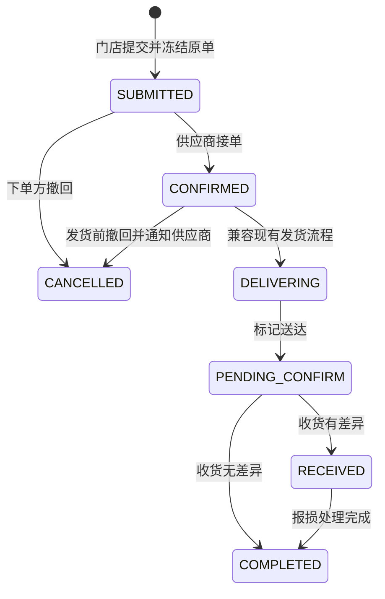

# 滇界 V4 订货单模块整改与验证计划

日期：2026-07-15
状态：本地 P0 实施与核心验收完成，待生产结构副本验证和发布审批
范围：门店订货单的创建、冻结、修订、撤回、查询、权限和审计
不包含：独立配送单、商品图片、供应商库存高级单据、综合报表

## 1. 本轮目标

将当前 `PurchaseOrder` 从“会被发货过程持续改写的流程对象”调整为“可永久核查的订货业务凭证”。

完成后必须满足：

1. 门店提交瞬间的商品、数量、单价、金额、备注、门店、供应商和下单人永久保留。
2. 接单、改单、发货、送达、收货、报损均不能覆盖原始订货数据。
3. 提交后的任何业务修改都有原因、申请人、确认人、修改前后和时间。
4. 原始版本、当前有效版本和后续配送结果在接口和页面中口径明确。
5. 现有库存、收货、报损、凭证和账期流程在迁移期间继续运行。

## 2. 本轮边界

### 本轮包含

- 原始订货快照。
- 原始订货金额字段。
- 订单修订申请与审批。
- 订单状态事件和字段级审计。
- 撤回原因独立保存，不再拼接修改原始备注。
- 数据库持久化幂等，防止重复下单。
- 订单编号并发安全。
- 新旧数据兼容与历史回填。
- 店长、厨师长、总厨、供应商和管理员的权限矩阵。
- 订货单详情页的“原始单 / 修订记录 / 流程记录”视图。

### 本轮不包含

- 新建 `DeliveryOrder` 和配送明细。
- 多次/分批配送的正式数据结构。
- 配送单按商品、日期查询。
- 商品分类、图片和批量上下架。
- 仓库调拨、盘点单、退货单等高级库存功能。

本轮会为配送模块预留引用和数据口径，但不把两者重新挤回一个页面或一张表。

## 3. 当前实现与问题定位

### 当前创建流程

- 门店或厨师长调用 `POST /api/orders`。
- 创建后立即进入 `SUBMITTED`。
- 商品价格以数据库 `Product.price` 为准。
- `PurchaseOrderItem.quantity` 保存下单数量。
- `PurchaseOrderItem.unitPrice` 保存下单时单价。
- 订单号通过“当月订单数量 + 1”生成。
- 幂等只保存在 API 进程内存 60 秒。

### 当前数据被改写的位置

- 发货时 `PurchaseOrder.totalAmount` 被改成实发金额。
- 发货时 `PurchaseOrderItem.amount` 被改成实发金额。
- 供应商代加商品会直接新增原订单明细。
- 撤回订单会把撤回原因拼接进原始 `note`。
- 收货数量写回 `PurchaseOrderItem.receivedQty`。

### 关联影响面

订单金额和状态被以下模块使用：

- 店长、厨师长、供应商订单列表和首页。
- 供应商送货单打印页面。
- 门店收货和自动报损。
- 入库单、财务凭证、应付账期。
- 供应商客户分析、销量统计和首页统计。
- 通知、企微卡片和操作日志。

因此不能直接重新解释 `totalAmount` 或删除 `shippedQty/receivedQty`，必须使用兼容迁移。

## 4. 目标数据口径

### 三个明确口径

| 口径 | 定义 | 本轮来源 |
|---|---|---|
| 原始订货 | 门店首次提交的内容 | `submittedSnapshot` + `ordered*` 字段 |
| 当前有效订货 | 已审批修订后的业务版本 | 原始版本 + 已批准修订 |
| 实际履约 | 实发、实收和结算结果 | 暂时兼容现有字段；下轮迁移到配送单/收货单 |

所有接口和页面禁止只写模糊的“金额”。必须显示为“原始订货金额”“当前订货金额”“实发金额”或“实收金额”。

## 5. 数据模型设计

### 5.1 PurchaseOrder 扩展字段

建议新增：

```text
orderedTotalAmount     Decimal(12,2)  原始订货总额
currentOrderAmount     Decimal(12,2)  当前已批准版本总额
submittedAt            DateTime       首次提交时间
submittedSnapshot      Json           原始完整快照
submittedSnapshotHash  String         快照校验摘要
currentRevisionNo      Int             当前有效修订号，初始 0
idempotencyKey         String?         持久化防重键
cancelReason           String?
cancelledAt            DateTime?
cancelledById          String?
rowVersion             Int             乐观锁版本
```

兼容期保留现有 `totalAmount`，但在 API 层标记为 `legacyTotalAmount`。新页面不得用它判断原始金额。

### 5.2 PurchaseOrderItem 扩展字段

建议新增：

```text
orderedAmount          Decimal(12,2)  原始数量 × 原始单价
lineOrigin             Enum           ORIGINAL / APPROVED_REVISION / LEGACY_UNKNOWN
addedByRevisionId      String?
```

现有字段定义：

- `quantity`：继续代表首次写入该行时的订货数量。
- `unitPrice`：继续代表该行订货时的价格快照。
- `shippedQty` / `receivedQty`：兼容期保留，下轮配送模块迁移。
- `amount`：暂时保留旧逻辑，逐步废弃；所有新逻辑使用 `orderedAmount` 或修订快照。

### 5.3 PurchaseOrderRevision

```text
id                    String
tenantId              String
purchaseOrderId       String
revisionNo            Int
type                  ADD_ITEM / REMOVE_ITEM / CHANGE_QTY /
                      CHANGE_EXPECTED_DATE / CHANGE_NOTE / MIXED
status                PENDING / APPROVED / REJECTED / CANCELLED
reason                String
beforeSnapshot        Json
afterSnapshot         Json
changeSet             Json
requestedById         String
requestedAt           DateTime
reviewedById          String?
reviewedAt            DateTime?
reviewNote            String?
baseRowVersion        Int
createdAt             DateTime
```

约束：

- `(purchaseOrderId, revisionNo)` 唯一。
- 同一订单同一时刻只允许一条 `PENDING` 修订。
- 审批时检查 `baseRowVersion`，防止两个人同时处理造成覆盖。
- `beforeSnapshot/afterSnapshot` 创建后不可修改。
- 驳回后不可改为批准，需要重新发起修订。

### 5.4 PurchaseOrderEvent

订货单需要自己的不可变时间线，避免只依赖自由文本 `OpLog`：

```text
id, tenantId, purchaseOrderId
eventType             CREATED / SUBMITTED / ACCEPTED / REVISION_REQUESTED /
                      REVISION_APPROVED / REVISION_REJECTED / CANCELLED /
                      LEGACY_MIGRATED
actorId, actorRole
fromStatus, toStatus
metadata
requestId, ip
occurredAt
```

事件只能新增，不能更新和删除。事件与业务变更必须处于同一个数据库事务。

### 5.5 并发与唯一约束

- `@@unique([tenantId, createdById, idempotencyKey])`，`idempotencyKey` 为空时不参与防重。
- 订单编号使用数据库计数器/序列或独立 `BusinessNoSequence`，不再使用 `count + 1`。
- 修订审批使用 `rowVersion` 条件更新。
- 所有金额用 Decimal 运算，禁止通过 JS 浮点累加作为最终落库依据。

## 6. 原始快照内容

`submittedSnapshot` 至少保存：

```json
{
  "schemaVersion": 1,
  "orderNo": "PO...",
  "tenantId": "...",
  "store": { "id": "...", "name": "..." },
  "supplier": { "id": "...", "name": "..." },
  "expectedDate": "YYYY-MM-DD",
  "note": "原始备注",
  "createdBy": { "id": "...", "name": "...", "role": "..." },
  "items": [
    {
      "lineId": "...",
      "productId": "...",
      "code": "...",
      "name": "...",
      "spec": "...",
      "unit": "kg",
      "quantity": "10.00",
      "unitPrice": "5.50",
      "amount": "55.00"
    }
  ],
  "orderedTotalAmount": "55.00",
  "submittedAt": "ISO-8601"
}
```

快照保存商品名称、规格、单位和编码，避免以后商品主数据改名导致历史订单显示变化。

`submittedSnapshotHash` 用规范化 JSON 计算。它不是安全签名，而是用于自动发现原始数据被意外改写。

## 7. 状态与修改规则

### 7.1 状态流转



订单状态只表达生命周期，不代表原始内容被改变。

### 7.2 修订规则

- `SUBMITTED`：允许下单方撤回；允许供应商发起库存核查修订。
- `CONFIRMED`：发货前仍可发起修订，但不得静默修改。
- `DELIVERING` 及以后：禁止修订订货单；差异进入配送单或收货单。
- 原始快照永远不变。
- 批准修订后更新“当前有效订货版本”，同时保留原始版本。
- 取消只改变状态和取消字段，不改原始备注。

### 7.3 已确认的审批策略

- 供应商减少数量、删除商品、增加数量或增加商品：全部必须由门店确认后才能接单。
- 下单方在供应商接单前撤回：直接生效并通知供应商。
- 供应商及门店均不得通过订单修订改价；价格变化走独立调价审批并重新下单。
- 审批人：本店店长或厨师长；总厨代下的订单可由总厨处理；管理员可兜底。

## 8. API 改造计划

### 8.1 创建订单

`POST /api/orders`

- 持久化校验 `idempotencyKey`。
- 事务内生成并锁定订单号。
- 创建订单和明细。
- 生成原始快照、快照 hash、原始金额。
- 写 `CREATED/SUBMITTED` 事件。
- 事务提交后发送通知；通知失败进入可重试记录，不回滚订单。

响应增加：

```text
orderedTotalAmount
currentOrderAmount
currentRevisionNo
submittedAt
```

### 8.2 订单详情

`GET /api/orders/:id`

响应拆为：

```text
order                   基本信息和当前状态
original                原始快照
current                 当前有效订货版本
revisions               修订列表
timeline                状态与操作时间线
fulfillmentLegacy       兼容期实发/实收信息
totals                   ordered/current/shipped/received
```

旧字段继续返回一个发布周期，供现有页面使用。

### 8.3 修订接口

- `POST /api/orders/:id/revisions`：发起修订。
- `GET /api/orders/:id/revisions`：查看全部修订。
- `PATCH /api/orders/:id/revisions/:revisionId/approve`：批准。
- `PATCH /api/orders/:id/revisions/:revisionId/reject`：驳回。

请求必须包含：变更内容、原因、客户端看到的 `baseRowVersion` 和幂等键。

### 8.4 接单

`PATCH /api/orders/:id/confirm`

- 若存在待审批修订，禁止接单并提示先完成修订。
- 只变更状态，不改任何订单内容。
- 事务内写 `ACCEPTED` 事件。

### 8.5 撤回

`PATCH /api/orders/:id/cancel`

- 强制撤回原因。
- 写入 `cancelReason/cancelledAt/cancelledById`。
- 不再拼接修改 `note`。
- 使用条件更新避免与接单/发货并发冲突。

### 8.6 兼容供应商代加商品

现有 `POST /api/orders/:id/add-items` 分两步下线：

1. 兼容期内部改为创建 `PurchaseOrderRevision`，不再直接写订单明细。
2. 前端改用修订接口后，旧接口返回迁移提示并最终移除。

## 9. 页面改造计划

### 9.1 门店订货单详情

分为三个明确页签或区块：

1. 原始订货单：只读，显示原始总额和下单时商品快照。
2. 修订记录：显示每次修改前后、原因、申请人、确认人和结果。
3. 流程记录：提交、接单、撤回以及后续配送/收货事件。

存在修订时，页面顶部同时显示：

- 原始订货金额。
- 当前有效订货金额。
- 修订次数。

### 9.2 供应商订单详情

- 待接单时可选择“直接接单”或“库存不足，申请调整”。
- 调整页面只能提出修改，不直接覆盖原订单。
- 提交后显示“待门店确认”，不能接单。
- 门店批准后再接单。

### 9.3 管理端审计

- 可按订单号查看完整时间线。
- 每条修订显示字段级差异。
- 历史迁移订单显示“历史数据迁移”标记及可信度说明。

## 10. 权限矩阵

| 操作 | 店长 | 厨师长 | 总厨 | 供应商负责人 | 供应商员工 | 管理员 |
|---|---:|---:|---:|---:|---:|---:|
| 创建本店订货单 | 是 | 是 | 可代下 | 否 | 否 | 是 |
| 查看原始订单 | 本店 | 本店 | 全集团 | 自家订单 | 自家订单 | 全部 |
| 发起门店侧修订 | 本店 | 本店 | 代下订单/配置 | 否 | 否 | 是 |
| 发起供应商调整申请 | 否 | 否 | 否 | 是 | 可配置 | 是 |
| 批准供应商修订 | 本店 | 本店 | 代下订单/配置 | 否 | 否 | 是 |
| 接单 | 否 | 否 | 否 | 是 | 是 | 是 |
| 撤回 | 本店 | 本店 | 仅自己代下 | 否 | 否 | 是 |
| 查看完整审计 | 本店 | 本店 | 全集团 | 自家订单 | 仅简版 | 全部 |

所有查询必须同时校验 `tenantId` 和门店/供应商作用域。越权资源建议返回 404，减少资源枚举风险。

## 11. 历史数据迁移计划

### 11.1 扩展阶段

- 新增字段和表，先全部允许为空。
- 不删除、不改名旧字段。
- 创建必要索引，避免长时间锁表。

### 11.2 回填阶段

逐批处理历史订单：

- `orderedAmount = quantity × unitPrice`。
- `orderedTotalAmount = Σ orderedAmount`。
- `currentOrderAmount`：未发货订单按原始金额；已发货历史订单保留现有业务结果，同时记录迁移说明。
- `submittedAt = createdAt`。
- 根据订单、明细、商品快照生成 `submittedSnapshot`。
- 创建 `LEGACY_MIGRATED` 事件。

历史上由供应商追加的行：

- 优先通过 `OpLog` 识别。
- 可识别时标记 `APPROVED_REVISION` 并生成历史修订记录。
- 无法识别时标记 `LEGACY_UNKNOWN`，不伪装成确定的原始下单行。

### 11.3 双写与切换

1. 新代码先同时维护旧字段和新字段。
2. 读取接口优先返回新口径，旧页面仍可读取旧字段。
3. 完成前后端切换后，停止业务代码更新模糊金额字段。
4. 独立配送模块完成后再移除 `shippedQty/receivedQty` 的订单职责。

### 11.4 生产部署

- 先备份数据库并记录订单/明细/金额基线。
- 在生产结构副本或脱敏副本完整演练迁移。
- 低峰期执行扩展迁移。
- 回填采用小批量、可续跑、带进度记录的脚本。
- 使用功能开关逐租户启用新详情页和修订流程。
- 旧字段至少保留一个完整发布周期。

## 12. 实施任务拆分

### 工作包 A：数据库与领域服务

- Prisma 模型和迁移。
- 金额计算、快照规范化和 hash 服务。
- 订单号生成器和持久化幂等。
- 修订差异计算器。
- 状态转换和权限策略。

### 工作包 B：API

- 创建、详情、修订、审批、撤回、接单接口。
- 兼容 `add-items`。
- 结构化错误码。
- 事务内事件记录。

### 工作包 C：前端

- 门店原始订单详情。
- 供应商调整申请。
- 门店修订审批。
- 时间线和前后差异。
- 旧订单迁移标记。

### 工作包 D：迁移与观测

- 历史回填脚本。
- 数据一致性巡检脚本。
- 指标、告警和发布开关。
- 生产发布与回滚手册。

## 13. 验证总原则

验证不只检查页面是否能点，而是检查以下不变量：

1. `submittedSnapshotHash` 在接单、修订、撤回、发货、送达、收货后始终不变。
2. 原始订货总额始终等于原始行金额之和。
3. 批准修订后，原始版本不变，当前版本正确变化。
4. 每次状态变化和修订均有唯一责任人和时间。
5. 重复请求、并发审批和越权请求不会产生重复单或覆盖数据。
6. 入库单、报损和财务账期继续按实收口径计算。

## 14. 自动化测试计划

### 14.1 单元测试

新增测试至少覆盖：

- Decimal 金额计算和四舍五入。
- 快照字段排序、规范化和 hash 稳定性。
- 原始版本与修订版本差异计算。
- 修订允许/禁止的字段。
- 角色与门店/供应商作用域矩阵。
- 状态转换矩阵。
- 订单号并发生成。
- 幂等键命中与冲突。

### 14.2 API 集成测试

在隔离 PostgreSQL 中验证：

1. 创建订单后同时生成原始字段、快照和事件。
2. 相同幂等键重复提交 20 次只生成一张订单。
3. 供应商发起减量、增量、删项和加项修订。
4. 门店批准后当前版本变化，原始 hash 不变。
5. 门店驳回后订单内容不变化。
6. 两个审批人并发批准，只有一个成功。
7. 有待审批修订时不能接单。
8. 撤回只写取消字段，不改变原始备注。
9. 供应商 A 无法访问或修订供应商 B 的订单。
10. 门店 A 无法批准门店 B 的订单。
11. 历史订单缺少新字段时仍能读取。
12. 发货、送达、收货兼容流程执行后原始快照不变。

### 14.3 前端组件测试

- 原始订单与当前订单金额标签不会混淆。
- 修订差异正确显示新增、删除和数量变化。
- 待确认、已批准、已驳回状态正确。
- 没有权限的用户不显示操作入口。
- 历史迁移行显示来源不确定提示。
- 手机宽度下长商品名、规格和差异记录不溢出。

### 14.4 端到端测试

关键链路：

```text
厨师长下单
→ 供应商查看原始单
→ 供应商发现库存不足并申请减量
→ 店长查看前后差异并批准
→ 供应商接单
→ 兼容流程发货/送达
→ 门店收货
→ 生成入库单、账期和操作时间线
→ 再次核对原始快照完全未变
```

还需覆盖：直接接单、修订驳回、发货前撤回、短量报损和管理员兜底。

## 15. 数据迁移验证

迁移前后生成对账报告：

- 订单总数、各状态数量一致。
- 订单明细总数一致。
- 每单 `orderedTotalAmount = Σ(quantity × unitPrice)`。
- 原始金额与当前旧字段金额不同的订单单独列出。
- 已发货/已收货订单的实发和实收数量不丢失。
- Receipt、LossClaim、PaymentSchedule 关联数量一致。
- 快照生成失败和 `LEGACY_UNKNOWN` 行全部输出清单。
- 随机抽查至少覆盖每种订单状态和有/无实发调整的订单。

迁移脚本必须支持：

- dry-run。
- 指定批次大小。
- 断点续跑。
- 重复执行幂等。
- 输出成功、跳过、失败和校验差异。

## 16. 回归验证

必须回归以下既有功能：

- 店长/厨师长创建订单。
- 供应商接单、拒单、发货、标记送达。
- 门店确认收货。
- 实收短量自动生成报损。
- 供应商库存发货扣减。
- Receipt 入库单金额。
- 会计凭证生成。
- PaymentSchedule 账期生成。
- 供应商、门店和企微通知。
- 供应商送货单 PDF/打印。
- 各角色首页和订单数量统计。

## 17. 安全与非功能验证

### 安全

- 篡改 tenantId、storeId、supplierId、createdById 无效。
- 请求不存在或越权订单返回统一结果。
- `beforeSnapshot/afterSnapshot` 不接收客户端直接提交，以服务端计算为准。
- 审计事件禁止普通业务接口更新和删除。
- 关键修订、撤回和审批记录 requestId 与 IP。

### 并发

- 同时下单不会生成重复订单号。
- 同一订单并发修订只有一条待审批。
- 接单与撤回并发只能有一个成功。
- 修订批准与接单并发不会越过待审批检查。

### 性能目标

- 常规订单列表和详情查询不因快照/修订产生 N+1 查询。
- 订单列表不默认返回完整 JSON 快照。
- 详情页按需加载修订和时间线。
- 在预期数据量下记录接口 p95，并与改造前基线对比；明显退化则阻断发布。

## 18. 人工验收清单

由业务人员使用真实角色账号验收：

- 下单后截图与原始订单页逐项一致。
- 供应商无法直接改掉原始数量和金额。
- 供应商调整申请能明确看到改了什么、为什么改。
- 店长批准/驳回后双方显示一致。
- 撤回原因独立显示，原备注保持原样。
- 历史订单能打开，迁移标识清晰。
- 发货和收货后仍可打开原始订单核对。
- 财务应付金额仍来自实际入库/收货，不误用原始订货金额。

## 19. 发布门槛

满足以下条件才允许进入生产：

- Prisma 迁移在空库和生产结构副本均成功。
- 自动化测试全部通过。
- 历史迁移 dry-run 无未解释的金额差异。
- 关键 E2E 链路全部通过。
- 财务、库存、报损回归通过。
- 生产备份和回滚手册已准备。
- 功能开关可在不回滚数据库的情况下关闭新流程。

## 20. 回滚策略

- 数据库只做向前兼容的新增，不立即删除旧字段。
- 新功能通过租户级开关启用。
- 出现问题可关闭修订入口并恢复旧页面读取。
- 已生成的新快照、修订和事件保留，不做破坏性回滚。
- 回填脚本只填空字段；发现错误时通过修复脚本重新计算，不删除业务订单。

## 21. 已确认业务决策

2026-07-15 由项目负责人确认：

1. 供应商库存核查后提出的所有商品或数量修改，必须由门店确认后才能接单。
2. 订货单修订不允许修改价格；价格变化必须走商品调价审批并重新下单。

## 22. 2026-07-15 本地实施结果

已完成：

- 新增首次提交快照、SHA-256 快照哈希、原始金额、当前金额和行级原始值。
- 新增修订申请、门店批准/驳回、事件时间线、持久化幂等和并发版本号。
- 供应商只可在接单前申请调整商品/数量；存在待确认修订时，接单和拒单均被阻断。
- 修订请求的商品结构采用严格校验，传入单价字段会返回 400；服务端始终使用商品库价格。
- 原“接单后直接追加商品”入口已封口，返回迁移提示。
- 撤回/拒单原因独立保存，不再改写首次提交备注。
- 供应商订单页显示改单记录和待门店确认状态；门店页显示字段差异并提供确认/驳回操作。
- 补充历史快照回填脚本，默认 dry-run，支持按租户、批次和重复执行。
- 本地登录页支持 `?tenant=yaohai-test` 等明确租户参数；API 仍强制执行预览租户白名单。

本轮仍不包含独立配送单。现有发货、收货字段继续兼容，后续需按本计划边界拆分配送模块。

## 23. 2026-07-15 验证记录

- Prisma 迁移已在隔离本地库成功执行。
- 数据库与 Prisma schema 对比：`No difference detected`。
- API TypeScript 编译通过。
- Web TypeScript 类型检查通过。
- 订货单完整性单元测试：5/5 通过。
- 端到端链路通过：创建、持久化幂等、禁止改价、申请修订、待审期间禁止接单、门店批准、原始快照不变、当前金额更新、批准后接单、事件时间线。
- 页面人工验收通过：门店显示修改前后差异；供应商待审状态下接单按钮禁用；浏览器控制台无错误。
- 全量 API 基线为 41/42，通过项包含本次新增测试；失败项是既有美团同步游标用例，与订货单改动无关，需在美团模块单独处理。
- Web 当前没有配置 Vitest 测试文件，因此 `pnpm --filter @dianjie/web test` 会以“无测试文件”退出；本轮以 TypeScript 检查和浏览器验收替代。

生产环境尚未迁移、尚未发布。发布前仍须完成第 19 节的生产结构副本、历史回填 dry-run、财务/库存/报损回归和备份回滚审批。
