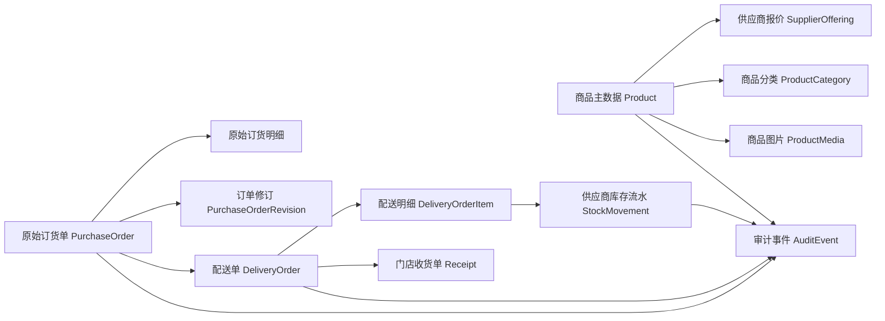

# 滇界 V4 供应商域架构整改方案

日期：2026-07-15
范围：供应商商品、门店订货、配送执行、供应商库存、审计与查询
输入：客户《系统问题(1)(1).docx》及当前 `dianjie-V4-rebuilt` 代码

## 1. 架构结论

客户反馈表面上是批量上下架、分类、图片、查询等页面功能，实质上要求系统具备四个可独立核查的业务域：

1. 商品主数据：SKU、分类、编码、图片、供应状态及审批记录。
2. 原始订货：永久保留门店提交时的商品、数量、价格、金额和下单人。
3. 配送执行：按实际拣货、称重和发货结果生成独立配送单，允许和订货单存在合理差异。
4. 库存台账：每次入库、出库、盘点、报损、退货形成不可删除的流水。

当前系统已经具备部分功能，但 `PurchaseOrder` 同时承担了原始订货单和配送执行单的职责。发货时会覆盖订单总金额和明细金额，供应商追加商品也直接写入原订单明细，因此无法完全满足“原始单据永久核查”的要求。

建议采用渐进式整改：保留现有接口兼容门店端，新增独立配送单和审计事件，先完成 P0 数据正确性，再补商品管理与高级库存功能。

## 2. 客户需求与现状差距

| 客户诉求 | 当前代码 | 判断 | 解决方向 |
|---|---|---|---|
| SKU 批量上下架 | 有批量上传和整批撤回；上下架仍以单品操作为主 | 部分具备 | 增加批量状态操作、批量审批及逐项结果 |
| 按分类筛选 | 商品有 `category`，前端按分类分组；分类是自由文本 | 部分具备 | 建立分类主数据、分类筛选和批量改类 |
| 显示商品编码 | 当前商品页已显示编码，但存在重复渲染 | 有缺陷 | 修复重复显示，所有查询与导出统一显示编码 |
| 商品图片同步门店选品 | `Product` 没有图片字段；只有菜品 `Dish` 有图片 | 缺失 | 增加商品媒体模型、上传及门店端缩略图 |
| 下发记录、操作时间、责任人 | 有 `OpLog`，但商品创建/修改等记录不完整，且不总与业务写入同事务 | 部分具备 | 建立统一审计事件并与业务写入同事务 |
| 配送单按日期、物品查询 | 订单 API 仅支持状态、门店、供应商；无日期和商品条件 | 缺失 | 新增服务器端组合查询和行级商品检索 |
| 原始订货单不可被配送修改 | 原始数量保留，但发货会覆盖订单总金额和明细金额 | 不满足 | 冻结原始单，配送单独立建模 |
| 修改前后均可核查 | 部分动作只留文本日志；没有统一前后快照和版本号 | 不满足 | 订单修订表 + 审计事件 + 差异视图 |
| 订货单与配送单是两道单据 | 当前送货单页面从 `PurchaseOrder` 动态生成 | 不满足 | 新增 `DeliveryOrder` / `DeliveryOrderItem` |
| 完整库存单据与报表 | 已有供应商入库、盘点、报损、发货出库流水 | 基础具备 | 先完善查询/退货/盘点单；高级仓储按真实场景分期 |

## 3. 当前代码中的关键风险

### P0 数据风险

- 发货接口会把 `PurchaseOrder.totalAmount` 改为实发金额，并把 `PurchaseOrderItem.amount` 改为实发金额。原始订货金额被覆盖。
- 供应商“代加物品”直接新增 `PurchaseOrderItem`，无法区分门店原始下单项与供应商后加项。
- 当前“配送单”没有持久化实体，而是读取采购订单实时生成，不能独立编号、独立查询、独立作废或分批配送。
- `SupplierStockMovement` 的设计说明是 append-only，但“清除全部 SKU”会删除库存流水和批次记录，与审计原则冲突。
- 供应商负责人和供应商员工的关键权限基本相同；员工也可创建/改价/清除商品，权限过宽。
- 发货扣库存没有明确的负库存策略，可能出现负数余额。

### P1 可用性风险

- 商品分类是自由文本，容易产生“酒水、酒 水、饮品”等重复分类。
- 商品列表只有前端内存搜索，数据量大后无法可靠分页搜索。
- 历史订单页上的搜索/筛选图标没有实际查询功能。
- 部分状态文案仍使用旧状态名，与当前 `DELIVERING`、`CANCELLED` 枚举不完全一致。
- 商品编码在当前页面被重复渲染一次。

## 4. 目标领域模型

### 4.1 商品主数据

长期建议把当前 `Product` 拆分成：

- `Product`：集团标准商品，保存标准编码、名称、基础单位、分类和主图。
- `SupplierOffering`：某供应商对该商品的报价、供应规格、供应商编码、起订量、配送浮动上限和上下架状态。
- `ProductCategory`：租户级分类主数据，支持排序、启停和可选的两级分类。
- `ProductMedia`：商品图片，至少包含 URL、缩略图、排序、是否主图、上传人和上传时间。

为控制改造风险，第一阶段可继续使用现有 `Product.supplierId`，先补 `categoryId` 和图片模型；待多供应商同品比价场景明确后再拆 `SupplierOffering`。

### 4.2 原始订货单

`PurchaseOrder` 在 `SUBMITTED` 后冻结以下字段：门店、供应商、期望日期、原始备注、原始总额、下单人。`PurchaseOrderItem` 冻结商品快照、订购数量、订购单价和原始金额。

后续变更必须通过 `PurchaseOrderRevision`：

- revisionNo：修订序号。
- reason：变更原因。
- beforeSnapshot / afterSnapshot：变更前后完整快照。
- changedById / changedAt：责任人及时间。
- approvalStatus：需要门店确认的追加或改量必须留确认结果。

供应商群里追单的“代加物品”不再直接改原单。建议形成订单修订，门店确认后生效；若仅属于实际多发，则只进入配送单，不进入原始订货单。

### 4.3 独立配送单

新增：

- `DeliveryOrder`：配送单号、来源订货单、供应商、门店、状态、计划/发货/送达时间、发货人、备注、实际总额、版本号。
- `DeliveryOrderItem`：关联原订货明细、实际发货数量、单价快照、实际金额、批次和保质期信息。

业务规则：

1. 接单不修改原始订货单。
2. 备货时创建配送单草稿，可填写实际称重数量。
3. 确认发货后冻结配送单，并按配送明细扣供应商库存。
4. 一个订货单允许生成多张配送单，为缺货补送和分车配送留出空间。
5. 门店按配送单收货，生成 `Receipt`；订购量、实发量、实收量三列永久并列显示。
6. 配送单更正采用冲销/更正单或新版本，不覆盖已发货记录。

### 4.4 库存台账

继续沿用 `SupplierStockMovement` 的 append-only 思路，但必须落实：

- 禁止业务接口删除流水；商品只能归档，不能物理删除历史。
- 发货出库的 `sourceType/sourceId` 改为指向配送单或配送明细。
- 盘点采用“盘点单 + 差异确认 + 调整流水”，不直接无痕修改余额。
- 明确负库存策略，建议默认禁止，负责人可在租户配置中开启并记录授权。
- 所有库存动作记录商品、数量变化、变更后余额、原因、单据、责任人和时间。

客户截图中的生产入库、寄售、客户销售出库等高级功能不建议一次性全部照搬。第一阶段覆盖实际发生的供应商入库、配送出库、退货入库/出库、报损、盘点和其他调整；生产与寄售模块等确认真实业务后再启用。

## 5. 查询、筛选与报表

### 商品管理

- 条件：关键字、编码、分类、状态、审批状态、更新时间。
- 批量动作：上架、停售、改类、导出；每批最多固定数量并返回逐项成功/失败。
- 上下架必须遵循现有总厨审批规则，批量操作只生成一张批次审批单。

### 订货单

- 条件：下单日期、期望到货日期、门店、单号、商品、状态、下单人。
- 详情固定显示“原始数据”，另设“修订记录”和“关联配送单”。
- 商品条件必须在数据库侧通过订单明细过滤，不能只过滤当前前端已加载的 50 单。

### 配送单

- 条件：发货日期、送达日期、门店、商品、配送单号、来源订货单号、状态、发货人。
- 列表展示订购/实发差异；支持导出配送明细。
- 可从某个商品反查一段时间内所有门店的订购量、实发量和实收量。

### 库存与审计

- 流水支持日期、商品、类型、来源单号、操作人筛选。
- 日结报表至少包含期初、入库、配送出库、退货、报损、调整和期末。
- 审计记录支持按实体、动作、责任人和日期检索，并展示字段级前后差异。

建议索引：

- `purchase_orders(supplierId, createdAt)`
- `purchase_order_items(productId, purchaseOrderId)`
- `delivery_orders(supplierId, shippedAt)`
- `delivery_orders(storeId, shippedAt)`
- `delivery_order_items(productId, deliveryOrderId)`
- `supplier_stock_movements(supplierId, productId, createdAt)`
- `audit_events(tenantId, entityType, entityId, occurredAt)`

## 6. 权限方案

| 能力 | 供应商负责人 | 供应商员工 |
|---|---:|---:|
| 查看自家商品/订单/库存 | 是 | 是 |
| 接单、填写配送、标记送达 | 是 | 是 |
| 新建商品、批量上传 | 是 | 可配置 |
| 改价、申请停售、批量上下架 | 是 | 否 |
| 盘点调整、库存初始化 | 是 | 可配置审批 |
| 删除/清空历史数据 | 否 | 否 |
| 查看人员操作审计 | 是 | 仅本人或无权限 |

权限判断应从当前“角色集合判断”升级为权限点，例如 `supplier.product.manage`、`supplier.delivery.ship`、`supplier.stock.adjust`，以支持每家供应商的负责人授权员工。

## 7. 统一审计方案

新增 `AuditEvent`，或在严格兼容前提下增强 `OpLog`，字段至少包括：

- tenantId、entityType、entityId、eventType。
- actorId、actorRole、occurredAt、requestId、IP。
- beforeSnapshot、afterSnapshot、changeSet。
- sourceDocumentType、sourceDocumentId。

审计事件必须与业务变更处于同一数据库事务。商品创建、商品修改、批量上下架、订单修订、配送发货、送达、收货、库存调整和导入都必须写审计事件。

## 8. 商品图片方案

1. 使用现有上传能力存入 OSS，限制 JPG/PNG/WebP、文件大小和像素。
2. 后端生成或保存缩略图，门店下单列表只加载缩略图，详情页加载原图。
3. 商品默认一张主图，可预留多图；无图片时使用统一占位图。
4. 图片变更同样记录上传人、时间和前后图片。
5. 门店选品接口直接返回主图地址，供应商端上传后经审批或保存即可同步显示。

## 9. 分阶段实施

### P0：单据正确性与审计底座

- 新增独立配送单及明细。
- 冻结原始订货数据；停止发货时覆盖原始金额。
- 把供应商追加改成订单修订或配送差异。
- 配送出库关联配送单，禁止删除库存流水。
- 拆分供应商负责人/员工关键权限，移除生产环境“清除全部 SKU”。
- 统一关键动作审计并放入事务。
- 为历史订单迁移生成原始金额和配送快照。

验收标准：任意订单均可同时看到原始订购、实际发货、实际收货，三者互不覆盖；每次变化均可定位责任人和时间。

### P1：客户明确提出的操作能力

- 商品图片、分类主数据、分类筛选、编码显示修复。
- 商品批量上下架、批量改类及批次审批。
- 订货单和配送单按日期、商品、门店、单号查询。
- 商品维度反查门店订货/实发/实收记录。
- 配送单和库存流水导出。

验收标准：客户无需逐单翻找即可回答“某商品在某日期区间被哪些门店订了多少、发了多少、收了多少、由谁操作”。

### P2：仓储深化

- 盘点单、供应商退货、门店退货、调拨、库存锁定。
- 批次和保质期的 FIFO/FEFO 扣减。
- 多仓库、多配送中心、司机或配送员角色。
- 根据实际业务启用生产、寄售和客户销售出库模块。

## 10. 历史数据迁移

当前历史数据仍可恢复出大部分原始值：

- 原始订购数量使用 `PurchaseOrderItem.quantity`。
- 原始单价使用 `PurchaseOrderItem.unitPrice`。
- 原始行金额重算为 `quantity × unitPrice`。
- 实发数量使用 `shippedQty`，为空时按原始数量。
- 对已发货订单生成一张兼容配送单，实际金额按实发数量重算。

供应商后加商品目前没有稳定的行级来源标记。迁移时可结合 `OpLog` 识别；无法确定的行标记为 `LEGACY_UNKNOWN`，在界面明确提示“历史迁移数据，来源待核”。

## 11. 建议的默认业务决策

在客户未明确前，建议使用以下默认规则继续设计：

- 允许一个订货单分多次配送。
- 下单单价在原始单据中冻结；配送只能改数量，改价必须走订单修订。
- 第一阶段每家供应商只有一个虚拟仓库。
- 商品支持一张主图并预留多图。
- 库存默认不允许负数。
- 所有作废采用状态和冲销记录，不物理删除业务历史。

需要客户最终确认的三项是：是否存在分批配送、配送时是否允许改价、供应商是否有多个仓库。这三项会影响配送单和库存模型，但不影响先行实施 P0 的原始单据冻结与审计整改。
