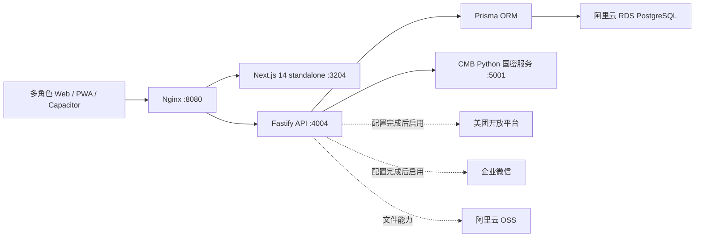
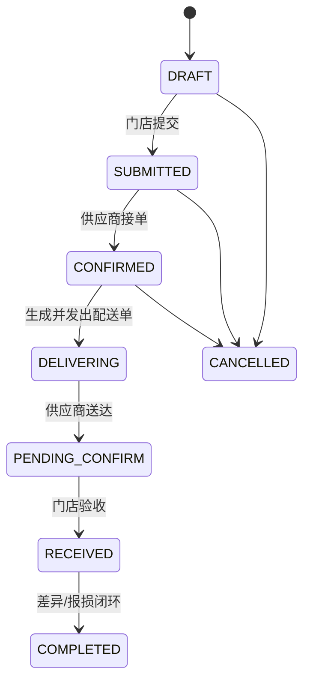
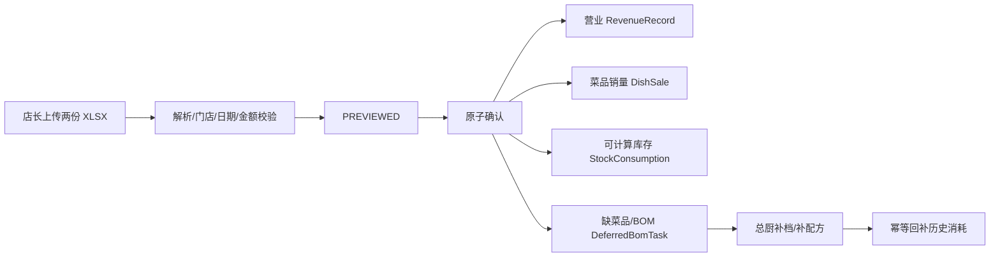

# 滇界 V4 多人并行开发交接总览

> 更新时间：2026-07-17 14:23（Asia/Shanghai）
>
> 业务代码基线：`5e0ac5a3864644d1c3ca20c903b99c76921099e5`（本文档提交只改变文档）
>
> 生产部署：同一提交 `5e0ac5a`，2026-07-17 13:50 发布成功
>
> 目标读者：项目负责人、架构负责人、后端、前端、测试、运维及接手本项目的 AI 开发者
> 本文是当前多人协作的权威入口；`HANDOFF.md`、`PROGRESS.md`、`README.md` 中的五月快照和旧部署命令仅作历史参考。

## 1. 项目一句话定位

滇界 V4 是南京云洱之境餐饮集团自用的多角色连锁餐饮经营管理系统，当前以合肥瑶海店为真实试点，目标逐步覆盖约 20 家直营门店。

系统核心不是单一“进销存”，而是把以下业务串成可审计闭环：

1. 厨师长/店长订货；
2. 供应商接单、调整实发数量、发货和送达；
3. 门店收货、差异和报损；
4. 供应商库存与门店预计库存分账；
5. 每日营业与菜品销量导入；
6. 菜品 BOM 换算食材消耗；
7. 对账、付款、发票、资金流水和凭证；
8. 老板、财务、总厨、店长、厨师长、供应商和工程部各自工作台。

当前产品优先服务集团真实运营，不以通用 SaaS 销售为近期目标；代码仍保留严格多租户隔离，并使用独立 `test` 租户做回归。

## 2. 当前权威状态

### 2.1 代码与生产

| 项目 | 当前状态 |
|---|---|
| GitHub | `git@github.com:somnusyi/dianjie-V4.git`；本文档位于 `main`，最后一个业务代码提交为 `5e0ac5a` |
| 当前本机开发分支 | `release/20260715-p0`；协作者必须以最新 `origin/main` 为准 |
| 生产应用提交 | `5e0ac5a` |
| 生产进程 | `dianjie-v4-api`、`dianjie-v4-web`、`dianjie-v4-cmb` 均在线 |
| 生产 API / Web | API `4004`、Web `3204`，Nginx 对外 `8080` |
| 当前可验证入口 | `http://116.62.32.162:8080`；健康检查返回 200 |
| HTTPS | `https://app.dianjie.cc` 当前连接失败；证书/域名处理按项目负责人指令暂缓 |
| 数据库 | 阿里云 RDS PostgreSQL，Prisma 迁移 47/47 已应用 |
| 最新迁移 | `20260717140000_deferred_bom_tasks` |
| 最近发布验证 | API 79/79、Web 7/7、TypeScript 通过、Next.js 136/136 页面、线上健康通过 |

生产机目录是部署产物目录 `/app/dianjie-v4`，不是开发工作区。任何同事不得直接在生产目录改代码。

### 2.2 生产业务快照（`dianjie` 租户）

以下是 2026-07-17 只读核验结果，用于帮助开发判断真实数据规模，不是测试造数：

| 数据 | 数量/状态 |
|---|---:|
| 正式门店 | 1 家：合肥瑶海店 `DJ001` |
| 正式用户 | 20 个启用账号 |
| 正式供应商 | 1 家 |
| 商品 SKU | 456 个，其中 361 个已绑定正式供应商 |
| 菜品档案 | 162 个，其中 161 个按 BOM 扣减、1 个明确排除库存 |
| BOM 明细 | 326 行，覆盖 88 个启用 BOM 菜品 |
| 仍无任何配方的启用 BOM 菜品 | 73 个；不代表都在当前菜单销售 |
| 订货单 | 51 张 |
| 独立配送单 | 47 张 |
| 入库单 | 46 张 |
| 门店盘点基准 | 2026-07-13，167/167 项匹配，总值 31,649.586 元 |
| 门店消耗记录 | 257 条：历史 BOM 导入 140 条、2026-07-16 日报 117 条 |
| 日报导入 | 2026-07-16 第 1 版已确认，营业额 5,717.40，营业收入 4,330.98，22 笔 |
| 总厨待补 BOM | 6 条，状态均为 `PENDING` |

生产库另有独立 `test` 租户。测试租户数据不得和正式租户汇总展示，也不得用正式租户执行破坏性 E2E。

### 2.3 2026-07-17 已跑通的真实日报链路

店长上传 2026-07-16 的两份表后，系统经历了以下真实流程：

1. 第一次确认因 BOM 指纹变化返回 `409 PREVIEW_REFRESHED`，只刷新预览，没有写业务数据；
2. 第二次确认返回 200；
3. 营业数据与销量进入正式表；
4. 117 个可计算食材 SKU 原子写入 `stock_consumptions`；
5. 6 个未完成菜品/BOM 转入 `deferred_bom_tasks`；
6. 后续总厨补齐 BOM 时，系统按日报销售快照幂等回补对应历史消耗。

移动端原生 `window.confirm` 会被部分微信/安卓 WebView 忽略。日报确认现已改用系统 `ConfirmSheet`；全项目新增确认交互时也必须沿用该组件。

## 3. 已确认的业务口径

这些规则已经由项目负责人确认，开发不得自行改口径：

### 3.1 采购、配送、收货

- 所有货物由供应商直接送到门店；当前不建设集团总仓或配送中心。
- 原始订货单必须保留，供应商不能无痕覆盖原始订购数量、单价和金额。
- 订单修改必须由门店确认；供应商不允许直接改订单价格。
- 一张订货单允许多次配送；每次配送形成独立配送单。
- 页面永久并列展示订购量、实发量和实收量。
- 供应商发货前可调整本次实发数量；旧浏览器缺少 `crypto.randomUUID` 时必须使用兼容幂等 ID。
- 已确认入库单如何更正、短量后的补送如何与报损结合，业务方仍在沟通；未确认前不要擅自实现“免费补送”或直接覆盖已入库数据。
- 当前业务判断是补送也要计算成本和库存，不应存在无成本、无库存影响的“免费补送”。

### 3.2 门店库存

- 所有食材暂定纳入库存管理。
- 最近可信实物基准是 2026-07-13 闭店盘点。
- 门店库存口径：最近盘点 + 后续实收入库 - BOM/人工消耗 - 店内报损。
- 采购短量从未入库，不能再作为门店报损重复扣库存。
- 门店消耗绝不能修改供应商 `Product.stock`；供应商库存和门店库存是两本账。
- 用户口中的“实时库存”在当前架构中是“按最新业务流水实时计算的预计库存”，不是实时称重的物理库存。页面和接口说明必须保留“预计”字样。
- 月度全量盘点功能目前由项目负责人暂缓，不作为当前并行开发的前置阻塞。
- 高级仓储、寄售、部门领退料、多仓调拨、锁库和复杂 FIFO/FEFO 暂不进入 P0。

### 3.3 菜品、BOM 与销量

- 店长在美团 API 接通前，每日上午 11:00 前上传前一天两份 XLSX：综合营业统计、菜品销售明细。
- 必须先预览，再由店长确认；确认后同时更新营业、销量和可计算库存消耗。
- 退菜不补回库存。
- BOM 用量按毛重口径。
- 鲜鸡与冻品在已确认规则内允许替代，但必须保留明确映射，不可用模糊名称自动串货。
- “百家蘸料”明确不扣库存，使用 `Dish.inventoryPolicy = EXCLUDE`。
- 赠品按对应库存商品直接扣减。
- 菜品未建档或缺少可执行 BOM 时，允许店长明确“暂缓并确认”；待办转交总厨，不再阻塞整份日报。
- 总厨工作台已有 `/v2/chef-director/bom`，用于处理待补 BOM 和历史消耗回补。

### 3.4 外部系统

- 美团 POS 接口代码已存在，但生产 `MEITUAN_ENABLED/MEITUAN_MODE` 未配置；当前真实数据源仍是每日双表上传。
- 招行 CMB 微服务在线，但 `CMB_AUTOPAY_ENABLED=false`，`CMB_SYNC_ENABLED` 未配置；不得开启自动付款。
- 企业微信数据库配置存在，但域名/HTTPS和完整 SSO 端到端状态未完成当前验收。
- Sentry、微信告警 Webhook 当前未配置。
- 凭证轮换和证书处理按项目负责人要求暂缓，任何同事不得自行轮换或停用生产凭证。

## 4. 技术架构



### 4.1 Monorepo

| 路径 | 职责 | 技术 |
|---|---|---|
| `apps/web` | 各角色前端、PWA/Capacitor、页面和共享组件 | Next.js 14、React 18、Tailwind、Zustand、Recharts |
| `apps/api` | REST API、领域服务、调度、外部集成 | Fastify 4、TypeScript、Zod、BullMQ |
| `apps/cmb` | 招行国密请求微服务 | Python/Flask 兼容服务 |
| `packages/db` | Prisma schema、迁移、客户端和 seed | Prisma 5、PostgreSQL |
| `scripts` | 部署、回滚、迁移核验、API/UI E2E | Bash、Node、Playwright |

### 4.2 关键共享基础设施

- 鉴权：JWT access + refresh，access 约 2 小时、refresh 约 30 天；`authVersion` 用于改密后撤销 refresh。
- 租户隔离：所有正式查询必须带 `tenantId`，门店角色还要带 `storeId`，供应商角色带 `supplierId`。
- 金额：Prisma `Decimal`，禁止用 JS 浮点直接累计资金。
- 幂等：业务写入使用 `idempotencyKey/requestKey/sourceId` 和数据库唯一约束双保险。
- 审计：关键状态变化写领域事件或 `OpLog`，必须和业务写入处于同一事务。
- 缓存：商品等主数据修改后必须执行对应 cache invalidate。
- WebView：禁止新增原生 `window.confirm/prompt/alert` 作为关键业务前置。

## 5. 角色与作用域

| 业务角色 | 数据库角色 | 默认范围 | 主要功能 |
|---|---|---|---|
| 老板/管理员 | `ADMIN` | 租户/集团 | 跨店经营、审批、人员、配置 |
| 财务 | `FINANCE` | 租户/集团 | 对账、付款、发票、资金、凭证、报表 |
| 店长 | `MANAGER` | 单店 | 日报、经营、库存、费用、门店事务 |
| 厨师长 | `KITCHEN_LEAD` | 单店 | 查看本店预计库存、订货、收货、消耗 |
| 总厨 | `CHEF_DIRECTOR` | 租户/集团 | 菜品/BOM、商品审批、报损仲裁、跨店采购 |
| 供应商负责人 | `SUPPLIER_OWNER` | 单供应商 | 商品、分类、库存、接单、配送、账单 |
| 供应商员工 | `SUPPLIER_STAFF` | 单供应商 | 被授权的接单、配送和库存操作 |
| 工程部 | `ENGINEERING` | 项目/门店 | 开店任务、工程进度 |

生产账号和密码不写入本文。需要账号时由项目负责人单独分发；测试账号规则可查看 `packages/db/src/seed-v2-test-accounts.ts`，但生产测试账号不得长期作为真实员工共享账号。

## 6. 核心领域与状态机

### 6.1 订货与配送



独立配送单状态：`DRAFT → SHIPPED → DELIVERED → RECEIVED`，异常终态为 `CANCELLED`。一张订货单可以关联多张配送单和多张入库单。

主要模型：`PurchaseOrder`、`PurchaseOrderItem`、`PurchaseOrderRevision`、`PurchaseOrderEvent`、`DeliveryOrder`、`DeliveryOrderItem`、`DeliveryOrderEvent`、`Receipt`、`ReceiptItem`、`LossClaim`。

### 6.2 日报与 BOM



日报状态：`PREVIEWED → CONFIRMING → CONFIRMED`；新版本确认后旧版本进入 `SUPERSEDED`。确认必须是单事务，禁止营业成功但库存只写一半。

### 6.3 门店预计库存

`estimatedStoreInventory()` 的权威口径：

> 最近盘点标准化数量 + 盘点后确认收货 - BOM/人工/日报消耗 - 店内报损

核心模型：`InventorySnapshot`、`InventorySnapshotItem`、`StockConsumption`、`Receipt/ReceiptItem`、`LossClaim`。供应商库存使用独立的 `SupplierStockMovement`，不能混算。

### 6.4 财务闭环

收货确认后可派生账期和凭证，后续进入对账、发票、付款和资金台账。当前代码已强化并发锁、唯一键、事务、失败补偿与凭证恢复，但真实自动付款继续关闭。

核心模型：`PaymentSchedule`、`Reconciliation`、`Payment`、`Invoice`、`InvoicePayment`、`CashAccount`、`CashTransaction`、`Voucher`、`VoucherGenerationFailure`、`PettyCash`、`Payroll`、`CapitalProject`。

## 7. 模块成熟度矩阵

| 模块 | 当前完成度 | 已验证 | 主要剩余工作 |
|---|---|---|---|
| 登录/账号/权限 | 高 | access/refresh、改密撤销、角色隔离、公开入口收紧 | 生产测试账号治理、企微绑定策略、即时踢下线可选方案 |
| 订货单 | 高 | 原始快照、修订确认、编号、并发和幂等 | 继续做真实用户 UAT；不要再改原始口径 |
| 配送单 | 高 | 独立实体、分批配送、实发调整、旧 WebView 兼容 | 高级查询/导出、取消/冲销细节 |
| 收货/报损 | 中高 | 原子收货、重试幂等、短量报损、自动确认 | 已确认入库更正、补送与报损最终规则待业务确认 |
| 供应商商品/分类 | 中高 | 商品审批、分类、库存入库/调整/报损、并发保护 | 商品图片、服务器端组合筛选、批量上下架/改类、导出 |
| 供应商库存 | 中高 | 独立流水、序列化写入、审计 | 批次余额、退货、盘点单、负库存策略 |
| 门店库存 | 中高 | 167 项盘点基准、预计库存、收货/消耗/报损滚动 | 月度盘点暂缓；单位换算补全、批次/FIFO/临期数量 |
| 菜品/BOM | 中 | 菜品档案、规格配方、损耗、排除策略、回补任务 | 73 个启用 BOM 菜品仍无配方；优先解决实际售卖缺口 |
| 每日营业导入 | 高（新上线） | 首份生产日报已确认、117 扣减、6 个暂缓任务 | 连续多日运营验证、提醒/逾期监控、更正版本 UAT |
| 经营报表 | 中高 | 营业额/收入/订单/优惠及时间对比 | 多店汇总、口径持续对账、美团自动化 |
| 财务/凭证 | 中高 | 核心并发、资金、对账、发票、付款和恢复测试 | 真实业务 UAT、策略统一、外部支付仍关闭 |
| 招行 CMB | 代码就绪、开关关闭 | 微服务在线、幂等/失败关闭测试 | 真实同步配置、影子验证、业务授权后才可开启 |
| 美团 | 代码和测试存在、生产未启用 | 解析/签名/同步单测 | 平台审核、正式配置、真实门店映射、双跑核对 |
| 企业微信 | 中 | 配置/通知/SSO 代码和安全边界 | HTTPS/域名、端到端登录和通知验证 |
| 监控/CI | 偏低 | 本地/部署脚本门禁较完整 | GitHub Actions、Sentry、告警、staging 环境 |

## 8. 多人并行开发建议

### 8.1 建议工作流划分

| 工作流 | 推荐负责人 | 独占代码范围 | 第一阶段任务 |
|---|---|---|---|
| A. 日报与 BOM | 后端+前端 1 组 | `dailyBusinessImport*`、`routes/dailyBusinessImports.ts`、`routes/dishes.ts`、店长上传页、总厨 BOM/菜品页 | 处理 6 条生产待办、补全实际售卖 BOM、验证历史回补 |
| B. 门店库存与厨师长 | 后端+前端 1 组 | `services/storeInventory.ts`、`routes/inventory.ts`、店长/厨师长库存页 | 厨师长预计库存与订货联动、低库存解释、单位问题提示 |
| C. 订货/配送/收货/报损 | 后端+前端 1 组 | `routes/orders.ts`、`deliveries.ts`、`receipts.ts`、`lossClaims.ts` 及对应厨师长/供应商页面 | 生产 UAT、收货更正方案；业务未确认前不写更正逻辑 |
| D. 供应商商品与库存 | 后端+前端 1 组 | `products.ts`、`supplierStock.ts`、`supplierInsights.ts`、供应商商品/分类/库存页 | 图片、分类筛选、批量动作、库存流水查询导出 |
| E. 财务 | 后端+前端 1 组 | 对账、付款、发票、现金、凭证、工资、备用金、资本支出模块 | 真实 UAT、错误补偿可视化；禁止开启真实自动付款 |
| F. 身份/企微/通知 | 安全后端 1 人 | `auth.ts`、`users.ts`、`applications.ts`、`invites.ts`、`wecom.ts`、`notifications.ts` | 企微端到端前置核对、测试账号治理、通知已读模型评估 |
| G. 质量与发布 | 架构/DevOps 1 人 | `packages/db/prisma`、`apps/api/src/index.ts`、`scripts`、CI、依赖锁 | 迁移仲裁、GitHub Actions、staging、监控、统一发布 |

### 8.2 必须由单一负责人串行修改的热点

以下文件极易造成多人冲突或生产事故，不能由多个工作流同时直接修改：

- `packages/db/prisma/schema.prisma` 和 `packages/db/prisma/migrations/**`；
- `apps/api/src/index.ts` 的路由注册与全局中间件；
- `apps/api/src/lib/auth-scope.ts`；
- `apps/api/src/lib/idempotency.ts`、`amount.ts`、`pagination.ts`；
- `apps/web/src/components/v2/index.tsx`、`confirm-sheet.tsx` 等全局组件；
- `pnpm-lock.yaml`；
- `scripts/deploy-worktree.sh`、回滚和迁移基线脚本。

建议 G 工作流担任“迁移与共享文件仲裁人”。其他工作流需要 schema 变化时先提交模型/约束提案，由 G 统一生成迁移，再继续 API 和页面开发。

### 8.3 推荐分支和合并规则

1. 所有人从最新 `origin/main` 创建短分支，禁止从本机旧 `main` 开始；当前本机 `main` 落后远端，不能作为基线。
2. 命名：`feat/<domain>/<topic>`、`fix/<domain>/<topic>`、`test/<domain>/<topic>`。
3. 每个 PR 只服务一个业务目标，必须写数据表变化、API 变化、受影响角色、验证证据和回滚方式。
4. 跨模块大改使用 `integration/<epic>` 汇总，不把半成品直接合入生产 `main`。
5. 合并前先同步 `origin/main`，解决冲突后重跑本模块和共享门禁。
6. 只有发布负责人可以执行生产部署；生产脚本只部署 `origin/main`。
7. 所有生产数据修复另写只读审计和带备份的数据脚本，不能把临时 `psql` 当正式方案。

### 8.4 PR 必填模板

```text
业务目标：
已确认口径：
涉及角色：
涉及 API：
涉及表/约束：
状态机变化：
跨角色影响：
幂等/并发策略：
测试证据：
迁移与回滚：
未解决风险：
```

## 9. 建议立即启动的并行任务

### P0：先保证真实门店每天能稳定使用

1. **BOM 待办闭环**：总厨确认 6 个当前生产待办的菜品/配方，逐项回补并验证不重复扣减。
2. **实际售卖 BOM 覆盖率**：按最近 30 天销量排序清理 73 个无配方菜品，不按全目录机械补造。
3. **厨师长库存与订货 UAT**：以真实厨师长账号验证库存、低库存、订货、订单状态和收货；页面统一称“预计库存”。
4. **日报连续运行**：连续验证 7 天双表上传、逾期、重复文件、更正版本、刷新后再确认和暂缓任务。
5. **采购闭环生产回归**：真实跑一张小额订单的下单→接单→改实发→发货→送达→收货→库存→账期。
6. **CI/监控底座**：建立 GitHub Actions，至少覆盖 API/Web 测试、TypeScript、Prisma validate、迁移链和生产构建；补 Sentry 或等价 5xx 告警。

### P1：客户明确提出但不阻塞每日营业

1. 供应商商品图片和门店选品同步；
2. 商品分类主数据增强、服务器端筛选、批量上下架/改类和导出；
3. 订货单/配送单按日期、商品、门店、单号组合查询；
4. 供应商与门店库存流水导出；
5. 收货更正/冲销方案在客户确认后实现；
6. 多店老板大屏、集团报表和 20 店性能验证。

### P2：依赖外部条件或业务成熟度

1. 美团 API 正式接入、双跑与停用手工上传的切换方案；
2. 企业微信 SSO、通知卡片和通讯录同步；
3. 招行流水同步与支付策略影子评估；
4. HTTPS、域名、证书和凭证轮换；
5. staging 环境、脱敏生产副本和容量压测；
6. 批次余额、FIFO/FEFO、退货、盘点单和高级仓储。

## 10. 尚待业务负责人确认的事项

| 事项 | 当前临时规则 | 开发约束 |
|---|---|---|
| 已确认入库更正 | 尚未定稿 | 不覆盖原记录；先做方案和测试，不上线写入 |
| 补送与报损关系 | 补送要计成本和库存，不设免费补送 | 等客户确认状态机后实现 |
| 负库存 | 尚未明确 | 默认不应静默允许，先告警/阻止 |
| 月度盘点 | 暂缓 | 不作为 P0 前置；保留当前 7.13 基准 |
| 菜品替代料优先级 | 鲜鸡/冻品可替代，其他逐项确认 | 禁止用模糊匹配批量替代 |
| HTTPS/凭证轮换 | 暂缓 | 未获负责人授权不得操作 |
| 美团上线时间 | 等平台与配置 | 手工双表仍是生产真源 |
| 20 店组织/主数据 | 仅瑶海真实试点 | 不假设各店菜单、供应商、库存完全相同 |

## 11. 本地开发与测试门禁

### 11.1 初始化

```bash
pnpm install --frozen-lockfile
cp .env.example .env
docker-compose up -d
pnpm --filter @dianjie/db exec prisma generate
pnpm --filter @dianjie/db exec prisma migrate dev
```

每位同事使用自己的隔离数据库或明确的共享测试库。禁止本地 `.env` 指向生产数据库。

### 11.2 每个 PR 的最低验证

```bash
pnpm --filter @dianjie/api test
pnpm --filter @dianjie/api build
pnpm --filter @dianjie/web test
pnpm --filter @dianjie/web exec tsc --noEmit
WEB_PORT=3299 pnpm --filter @dianjie/web build
bash scripts/verify-local-migration-chain.sh
```

涉及角色或状态机时还必须运行：

```bash
node scripts/e2e-full-flow.js
node scripts/ui-smoke.js
```

注意：`web-next-safe.sh` 会阻止同一工作树同时运行 Next dev 和 build。开发服务不要与生产构建共用工作树；构建或部署使用独立 worktree。

### 11.3 数据库规则

- 本地通过 `prisma migrate dev` 生成迁移；生产只允许 `prisma migrate deploy`。
- 禁止用 `prisma db push` 替代正式迁移。
- 新迁移必须验证：现有库升级、空库全链重建、`schema.prisma` diff 为零。
- 约束、索引、枚举和数据回填必须在同一 PR 中解释兼容与回滚。

## 12. 生产发布与回滚

当前权威发布工具是独立部署 worktree 中的：

```bash
./scripts/deploy-worktree.sh
```

它会：锁定单人部署、拉取最新 `origin/main`、检查生产提交祖先关系、安装依赖、运行 API 测试、构建 API/Web、备份生产数据库和构建、上传、执行迁移、生成 Prisma Client、重启 PM2、验证 API/Web 并标记 `.deployed-commit`。

发布红线：

- 禁止直接修改 `/app/dianjie-v4`；
- 禁止手工 SCP/rsync 代替完整发布；
- 禁止多人同时部署；
- 禁止未备份就迁移；
- 禁止发布工作树包含 `.env`、数据库 dump、真实 XLSX 或其他未跟踪业务文件；
- 默认只回滚应用构建，不回滚数据库；DB 回滚会丢失发布后的真实业务数据，必须由项目负责人批准。

## 13. 已知文档与代码陷阱

1. `HANDOFF.md` 是 2026-05-16 快照，提交号、测试数、路径、JWT 口径和待办已过期。
2. `PROGRESS.md` 是更早的 2026-04-30 快照，只能用于了解产品历史。
3. `README.md` 的端口和旧账号示例不是当前生产运行说明。
4. `CLAUDE.md` 的质量门禁仍有价值，但其中“改 schema 后直接 db push ECS”等旧部署说明已被迁移链和 `deploy-worktree.sh` 取代。
5. `RELEASE_READINESS_2026-07-17.md` 记录的是 `7c2c2f0` 本地候选；之后又上线了 BOM 暂缓、数据映射、静态资源和移动确认修复，当前提交应以本文为准。
6. 根目录未跟踪文件 `库存主数据映射审计_2026-07-15.xlsx` 属于业务资料，不得被任何开发分支误提交。

## 14. 关键代码索引

| 目标 | 入口 |
|---|---|
| API 路由注册 | `apps/api/src/index.ts` |
| 数据模型/状态枚举 | `packages/db/prisma/schema.prisma` |
| 日报解析与 BOM 计算 | `apps/api/src/services/dailyBusinessImport.ts` |
| 日报 API | `apps/api/src/routes/dailyBusinessImports.ts` |
| 店长日报页 | `apps/web/src/app/v2/manager/upload-platform/page.tsx` |
| 总厨 BOM 待办 | `apps/web/src/app/v2/chef-director/bom/page.tsx` |
| 门店预计库存 | `apps/api/src/services/storeInventory.ts` |
| 库存 API | `apps/api/src/routes/inventory.ts` |
| 订货单完整性 | `apps/api/src/services/purchaseOrderIntegrity.ts` |
| 订货/配送/收货 | `apps/api/src/routes/orders.ts`、`deliveries.ts`、`receipts.ts` |
| 报损 | `apps/api/src/routes/lossClaims.ts` |
| 供应商库存 | `apps/api/src/routes/supplierStock.ts` |
| 权限范围 | `apps/api/src/lib/auth-scope.ts` |
| Web 鉴权 | `apps/web/src/lib/v2-auth.ts` |
| 移动端确认弹层 | `apps/web/src/components/v2/confirm-sheet.tsx` |
| API 测试 | `apps/api/tests` |
| Web 单元测试 | `apps/web/src/**/*.test.ts` |
| 全角色 E2E | `scripts/e2e-full-flow.js`、`scripts/ui-smoke.js` |
| 发布 | `scripts/deploy-worktree.sh` |
| 长时审计证据 | `LONG_RUN_2026-07-16.md` |

## 15. 新同事第一天建议

1. 拉取 `origin/main`，确认 HEAD 是本文记录的提交或其后继提交。
2. 阅读本文、`CLAUDE.md` 的质量门禁、自己工作流对应的 route/service/page 和测试。
3. 不要先读完整 2600 行 Prisma schema；先按本文模型索引定位业务域。
4. 在 Issue/群里声明工作流和将修改的共享文件，先解决所有权冲突。
5. 先补测试或建立失败复现，再修改业务逻辑。
6. 用 `test` 租户跑写入型 E2E；正式租户只做经批准的 UAT。
7. PR 中给出跨角色影响和数据库核验，不以“页面能点”作为完成标准。
8. 没有项目负责人确认时，不操作证书、凭证、真实支付、历史数据修复和已确认入库更正。

---

维护规则：每次生产发布后，由发布负责人更新本文顶部提交、测试基线、迁移数量、生产业务快照和未决事项；模块负责人更新自己负责行的成熟度与剩余工作。
